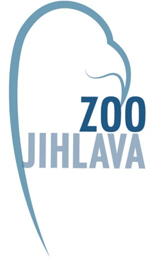
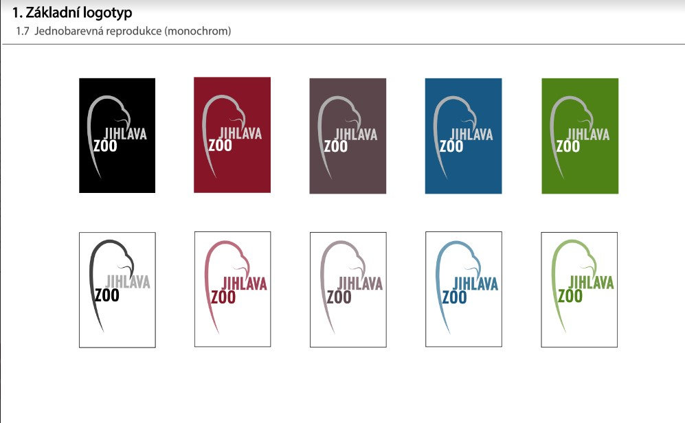
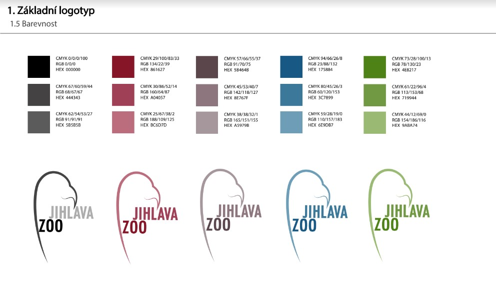
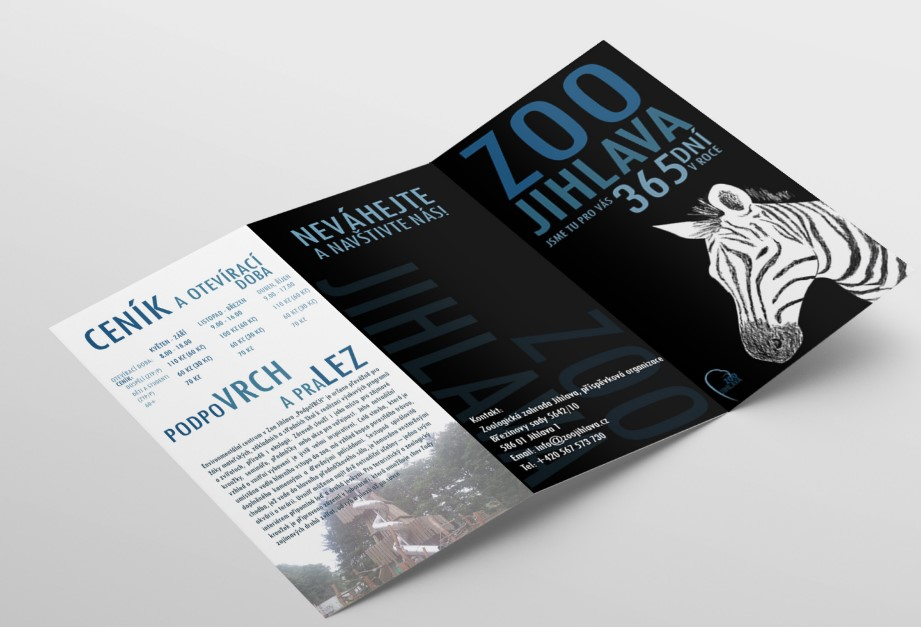

# Logo manual: 

 

 

 

A few years ago, I worked on a school project whose assignment was a logo manual. I chose Jihlava zoo because their communication elements were as outdated as their logo. The advantage was that I had recently been to the zoo in question.
The first what I do was research and evaluate the competition. after that I started making designs for the logo. I drew  meny designs on paper and choise good one. 
Whan I created logo I started with logo manual. I folowed logo manual for Prague zoo, becauce I didn´t know how it looks like. 
I created more material: posters, brochures, maps and billboards. Brochures folowed bacis informations from the webside.  
I created pictograms to create communication. Also I opened the zoo map and redesigned it in a new style with easy navigation. With color of the logo and all communication. 
 Logo manual has almost 30 pages contained color, backgrounds, minimal largest, 

 

