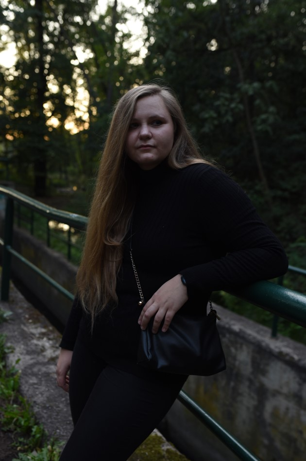

# RESUMÉ

I am studying graphic design. 
I love books, art and illustration. 
I often go to art exhibitions for inspiration. 
I like clean and simple work. 
I am focusing on illustration. 

## Work Experience

### RUGBY
Czech women‘s rugby team was a teamwork. 
We focused on popularizing women‘s rugby. 
Audience was young woman (18 - 24 age). 
Our strategy was sharper than other teams. 
The visual style was in a black and red variant 
to make it look more aggressive and be better remembered.

### BEER VATICAN
As part of the project, 
we worked on the idea of combining two distinctive 
things in the Czech Republic. 
That‘s beer and atheism and  put them together to make beer faith. 
This is the visual identity of the city of Volhynia, 
which is known for strong relationship with beer. 
We treated it like any other identity of the city and a whole communication was created.

## Experience
2022 - 2020 - University experience. 
I worked on school projects. Outside of school, 
I helped a yoga instructor to become visible on social networks and redesign her website.

2020 - 2016 - I finished High School of design and art in Prague 

2020 - 2016 Studying High School of design and art: 
- painting courses 
- figurative drawings 
- trying out new techniques (such as linocut…)
- gaining knowledge in Adobe programs and Cinema 4D

## Tools
- Adobe Potoshop
- Adobe Illustrator
- Adobe InDesign
- Adobe XD
- Adobe After Effects
- Cinema 4D
- Sketchbook
- Clip Studio

## Design
- Sketching and storyboarding
- Illustrations
- Prototyping
- Mobile and web design

## Languages
- Czech (native)
- English (advanced)

## Contact me
  Email: eri.vaclavikova@gmail.com
  Phone number: +420 604 508 374

